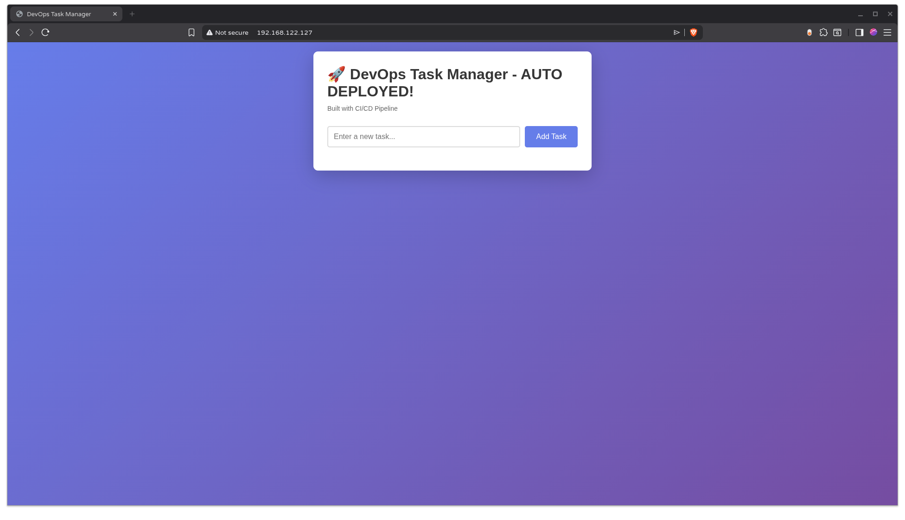
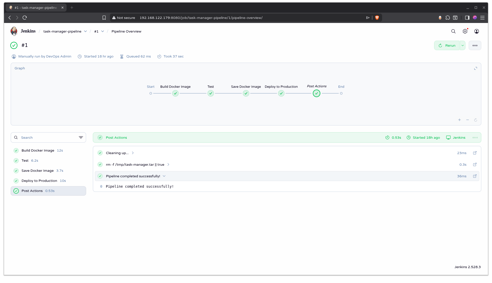

# Automated CI/CD Pipeline for Task Manager Application

A complete DevOps project demonstrating automated build, test, and deployment using Jenkins, Docker, and KVM virtualization.

## 🚀 Project Overview

This project implements a full CI/CD pipeline that automatically builds, tests, and deploys a containerized Flask web application. The infrastructure includes virtualized servers managed with KVM and cloud-init, showcasing Infrastructure as Code principles.

**Live Demo:** [Note: Add screenshot or video link]

## 🏗️ Architecture

```
┌─────────────┐      ┌──────────────┐      ┌─────────────────┐
│   Developer │─────▶│   Jenkins    │─────▶│   Production    │
│   (Git)     │      │   Server     │      │   Server        │
│             │      │              │      │                 │
│  Code Push  │      │ Build, Test  │      │ Docker          │
│             │      │ Docker Image │      │ Container       │
└─────────────┘      └──────────────┘      └─────────────────┘
                            │
                            ▼
                     Automated Health
                     Checks & Monitoring
```

## 🛠️ Technologies Used

### Core Technologies
- **CI/CD:** Jenkins
- **Containerization:** Docker, Docker Compose
- **Application:** Python Flask, JavaScript, HTML/CSS
- **Virtualization:** KVM/libvirt
- **Automation:** cloud-init, Bash scripting
- **Version Control:** Git

### Infrastructure
- **OS:** Ubuntu Server 22.04 LTS
- **Networking:** NAT, SSH
- **Security:** SSH key authentication, credential management

## ✨ Features

- ✅ **Automated CI/CD Pipeline** - Builds and deploys on code changes
- ✅ **Containerized Application** - Consistent environments with Docker
- ✅ **Infrastructure as Code** - Reproducible VM provisioning with cloud-init
- ✅ **Automated Testing** - Health checks prevent bad deployments
- ✅ **Zero-Downtime Deployment** - Rolling updates with minimal interruption
- ✅ **Monitoring** - Continuous health checks and logging
- ✅ **Security** - SSH key-based authentication throughout

## 📋 Prerequisites

- Linux host (tested on OpenMandriva Lx)
- KVM/libvirt virtualization support
- 16GB+ RAM (32GB recommended)
- 50GB+ free disk space
- Docker installed

## 🚀 Quick Start

### Try the Application (No Infrastructure Required)

You can run the task manager application locally without setting up the full CI/CD infrastructure:

#### Local Development
```bash
git clone https://github.com/Jobdm/devops-cicd-pipeline.git
cd devops-cicd-pipeline/app

# Create virtual environment
python3 -m venv venv
source venv/bin/activate

# Install dependencies
pip install -r requirements.txt

# Run application
python app.py
```

Open your browser to `http://localhost:5000`

#### Docker Container
```bash
# Build image
docker build -t task-manager:latest -f docker/Dockerfile .

# Run container
docker run -d -p 5000:5000 --name task-manager task-manager:latest

# View logs
docker logs task-manager

# Stop container
docker stop task-manager && docker rm task-manager
```

Open your browser to `http://localhost:5000`

---

## 🏗️ Full Infrastructure Setup (Advanced)

To replicate the complete CI/CD pipeline with automated deployment infrastructure:

### Prerequisites
- Linux host with KVM/libvirt virtualization
- 16GB+ RAM (32GB recommended for smooth operation)
- 50GB+ free disk space
- Docker installed on host
- Basic command line proficiency
- **Time commitment:** 8-12 hours total

### What You'll Build

This project demonstrates a complete DevOps workflow:

1. **Infrastructure Layer**
   - 2 KVM virtual machines provisioned with cloud-init
   - Network configuration and SSH key authentication
   - Automated VM initialization

2. **CI/CD Pipeline**
   - Jenkins automation server
   - Automated Docker image builds
   - Continuous testing with health checks
   - Automated deployment to production

3. **Monitoring**
   - Health check endpoints
   - Automated monitoring with logging
   - Deployment verification

### Setup Phases

**Phase 1: Application & Containerization** (~2-3 hours)
- Build and test Flask application
- Create Docker containers
- See Quick Start above

**Phase 2: Infrastructure Provisioning** (~3-4 hours)
- Create and configure virtual machines
- Set up networking and SSH keys
- Provision with cloud-init
- **Detailed guide:** [INFRASTRUCTURE.md](docs/INFRASTRUCTURE.md)

**Phase 3: Jenkins CI/CD Pipeline** (~3-4 hours)
- Install and configure Jenkins
- Create automated pipeline
- Configure deployment automation
- **Detailed guide:** [PIPELINE.md](docs/PIPELINE.md)

### Architecture Overview
```
┌──────────────┐       ┌───────────────┐       ┌──────────────────┐
│   Developer  │──────▶│  Jenkins VM   │──────▶│  Production VM   │
│   Workstation│       │               │       │                  │
│              │       │ • Build       │       │ • Docker Runtime │
│ • Git commits│       │ • Test        │       │ • Application    │
│ • Code review│       │ • Deploy      │       │ • Monitoring     │
└──────────────┘       └───────────────┘       └──────────────────┘
```

### Quick Setup Summary
```bash
# 1. Download Ubuntu cloud image
wget https://cloud-images.ubuntu.com/jammy/current/jammy-server-cloudimg-amd64.img

# 2. Create cloud-init configurations
# See vm-configs/ directory for templates

# 3. Provision VMs with virt-install
# See INFRASTRUCTURE.md for commands

# 4. Install Jenkins on Jenkins VM
# See PIPELINE.md for installation steps

# 5. Configure and run pipeline
# Jenkinsfile included in repository
```

For complete step-by-step instructions, see the documentation in `/docs`.

### Simplified Alternative

If you want to explore the concepts without full infrastructure:
- Use **Docker Compose** to run multiple containers locally
- Use **Minikube** for local Kubernetes learning (future enhancement)
- Deploy to cloud platforms (AWS, Azure, GCP) instead of local VMs

---

## 📁 Project Structure

```
task-manager-pipeline/
├── app/                    # Flask application
│   ├── app.py             # Backend API
│   ├── requirements.txt   # Python dependencies
│   ├── templates/         # HTML templates
│   └── static/            # CSS, JavaScript
├── docker/                # Container configuration
│   ├── Dockerfile         # Image definition
│   └── docker-compose.yml # Multi-container setup
├── vm-configs/            # Infrastructure as Code
│   ├── jenkins/           # Jenkins VM config
│   └── production/        # Production VM config
├── docs/                  # Documentation
│   ├── INFRASTRUCTURE.md  # VM architecture
│   └── PIPELINE.md        # CI/CD details
└── Jenkinsfile           # Pipeline definition
```

## 🔄 CI/CD Pipeline

The Jenkins pipeline automates deployment through five stages:

1. **Build** - Creates Docker image from source code
2. **Test** - Runs health checks to verify functionality
3. **Save** - Exports image for transfer
4. **Deploy** - Pushes to production and starts new container
5. **Verify** - Confirms successful deployment

**Deployment Time:** ~2-3 minutes from commit to production

## 🧪 Testing

```bash
# Run application tests
cd app
source venv/bin/activate
python -m pytest tests/

# Health check endpoint
curl http://localhost:5000/health

# Load test (if you add one)
ab -n 1000 -c 10 http://localhost:5000/
```

## 📊 Monitoring

Health checks run every 5 minutes via cron:
- Endpoint: `/health`
- Logs: `/var/log/production-health.log`
- Metrics: Response time, availability

## 🔒 Security Considerations

- SSH key-based authentication (no passwords)
- Credentials stored in Jenkins credential manager
- Network isolation via NAT
- Minimal base images (python:3.11-slim)
- Regular security updates via cloud-init

**Note:** This is a learning/demo project. Production deployments would require:
- TLS/SSL certificates
- Secrets management (HashiCorp Vault)
- Network segmentation
- WAF and DDoS protection
- Comprehensive logging and alerting

## 🎯 Learning Outcomes

This project demonstrates proficiency in:

- **DevOps Practices:** CI/CD, Infrastructure as Code, automation
- **Containerization:** Docker image building, multi-stage builds
- **Linux Administration:** VM management, networking, security
- **Scripting:** Bash, Python for automation
- **Version Control:** Git workflows, branching strategies
- **Problem Solving:** Debugging, troubleshooting, documentation

## 🔮 Future Enhancements

Potential improvements for production readiness:

- [ ] Kubernetes deployment for orchestration
- [ ] Prometheus + Grafana for advanced monitoring
- [ ] Multi-environment strategy (dev/staging/prod)
- [ ] Blue-green deployment strategy
- [ ] Automated rollback on failure
- [ ] Integration with cloud providers (AWS/Azure/GCP)
- [ ] Secret management with Vault
- [ ] Automated security scanning

## 📝 Documentation

Detailed documentation available in `/docs`:

- **[INFRASTRUCTURE.md](docs/INFRASTRUCTURE.md)** - VM architecture and management
- **[PIPELINE.md](docs/PIPELINE.md)** - CI/CD pipeline details and troubleshooting

## 🤝 Contributing

This is a personal learning project, but suggestions and feedback are welcome!

1. Fork the repository
2. Create a feature branch (`git checkout -b feature/improvement`)
3. Commit changes (`git commit -m 'Add improvement'`)
4. Push to branch (`git push origin feature/improvement`)
5. Open a Pull Request

## 📄 License

This project is open source and available under the [MIT License](LICENSE).

## 👤 Author

**Job Morales**
- GitHub: [@Jobdm](https://github.com/Jobdm)
- LinkedIn: [job-morales](www.linkedin.com/in/job-morales)
- Email: jobd.morales@gmail.com

## 🙏 Acknowledgments

- Built as a learning project to demonstrate DevOps skills
- Inspired by real-world production infrastructure patterns
- Technologies chosen based on industry standards

## 📸 Screenshots

### Application Interface


### Jenkins Pipeline


---

**⭐ If you find this project helpful, please consider giving it a star!**
